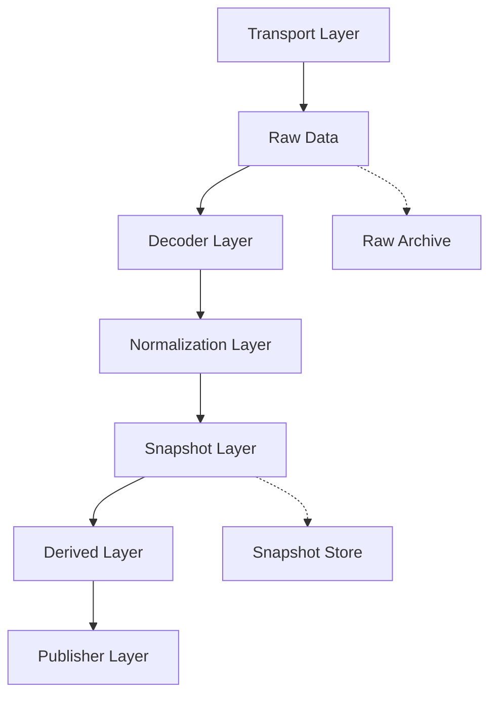
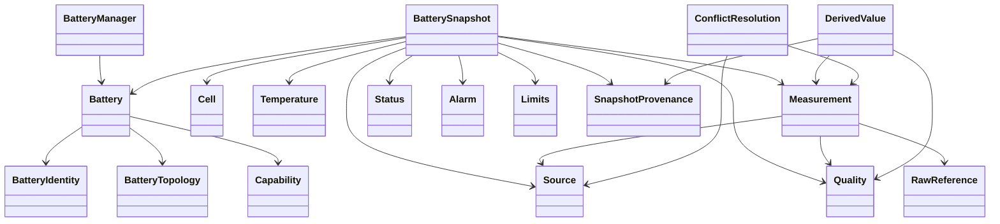

# Internal Data Model Architecture

Status: Target architecture
Scope: Internal model only
Audience: battery-gateway contributors and plugin authors

This document defines the intended internal data model of battery-gateway. It does
not describe the current Python implementation. It is an architecture
specification and serves as the reference for future implementations.

battery-gateway is not a Seplos tool, not a Home Assistant integration, not an
MQTT bridge, and not a CAN decoder. It is a manufacturer-independent battery
middleware. All transports, manufacturers, and publishers must map to the model
described here.

## 1. Project Goal

battery-gateway exists to connect arbitrary battery systems to arbitrary target
systems through a stable internal representation.

Battery systems differ widely in protocol, transport, terminology, scale factors,
field layout, alarm representation, and data quality. External systems also
differ widely. A stable middleware must not make any one external system the
center of the architecture.

The project goal is:

- read battery-related data from many sources,
- decode manufacturer-specific raw data,
- normalize all values into a shared internal model,
- derive higher-level values in one place,
- publish snapshots to external systems through replaceable adapters.

Home Assistant is a possible publisher target. It is not the internal model.
MQTT is a possible publisher or input transport. It is not the internal model.
CAN, BLE, RS485, UART, TCP, UDP, and log replay are possible transports. They are
not the internal model.

Manufacturer decoders must be replaceable because they represent knowledge that
will continue to change. Firmware versions differ, reverse engineering improves,
and devices sometimes report wrong or incomplete values. The core model must stay
stable while decoders evolve.

ARCHITECTURE DECISION: The internal model is the stable contract between readers,
decoders, derived-value calculation, battery management, and publishers.

## 2. Architecture Principles

### Single Source of Truth

The authoritative state of a battery at a point in time is a BatterySnapshot. All
publishers consume snapshots. No publisher owns battery state.

### Immutable Snapshots

A snapshot is immutable after creation. Corrections, later measurements, or
better source selection produce a new snapshot.

### Transport Independence

The internal model contains no BLE characteristic, CAN identifier, RS485 register,
UART command, TCP socket, UDP packet, MQTT topic, or replay file path as a primary
concept. These details belong to RawReference and Source metadata only.

### Manufacturer Independence

The internal model uses generic battery concepts: cells, measurements,
temperatures, alarms, status, limits, capabilities, source, quality, and
provenance. Manufacturer-specific details are retained as raw references or
extension metadata, not as core model structure.

### Publisher Independence

Publishers must not influence the internal model. Home Assistant entity names,
MQTT topics, Influx measurements, Victron mappings, and dashboard formatting are
publisher concerns.

### Replayability

Raw data and snapshots must be replayable. Replay must allow decoder testing,
regression testing, field validation, and later reprocessing with improved
decoders.

### Testability

Every layer must be testable in isolation. Decoders can be tested with raw
frames. Normalization can be tested with decoded values. Derived calculations can
be tested with snapshots. Publishers can be tested with snapshots without access
to hardware.

### Plugin Capability

New manufacturers, transports, and publishers must be added as plugins or
replaceable modules. Core model classes should not need changes when a new BMS is
supported.

### Extension Without Core Drift

The core model may allow extension fields, but these must not replace normalized
fields. Extensions preserve information; they do not define the common contract.

## 3. Layer Model

### Transport Layer

Responsibility:

- receive bytes, frames, messages, records, or events from an external medium,
- attach transport-level receive metadata,
- forward RawData to decoders or archives.

Examples of transports:

- BLE,
- CAN,
- RS485,
- UART,
- TCP,
- UDP,
- MQTT,
- log replay.

Not allowed in this layer:

- manufacturer field decoding,
- voltage/current scaling,
- battery state calculation,
- publisher formatting,
- alarm interpretation beyond transport-level errors.

### Decoder Layer

Responsibility:

- understand a manufacturer/protocol message format,
- verify frame-level integrity when applicable,
- extract raw fields,
- produce normalized measurements with Source, RawReference, Timestamp, and
  Quality.

Not allowed in this layer:

- power calculation,
- runtime calculation,
- SOC estimation,
- delta-cell calculation,
- averaging temperatures,
- publishing,
- Home Assistant, MQTT, Victron, InfluxDB, or dashboard knowledge.

### Normalization Layer

Responsibility:

- convert decoded fields into canonical units,
- map manufacturer terms to model terms,
- attach quality flags and confidence,
- preserve raw references.

Not allowed in this layer:

- cross-source conflict selection,
- derived-value calculation,
- publisher-specific naming,
- mutation of existing snapshots.

### Snapshot Layer

Responsibility:

- assemble normalized values into BatterySnapshot objects,
- preserve identity, topology, sources, quality, and provenance,
- represent one complete state at one point in time.

Not allowed in this layer:

- reading transports,
- decoding frames,
- publishing,
- mutating older snapshots.

### Derived Layer

Responsibility:

- compute values that can be derived from normalized measurements,
- document input values used for each derived result,
- attach quality and confidence to derived values.

Not allowed in this layer:

- raw frame parsing,
- manufacturer-specific offsets,
- publisher formatting,
- silent overwriting of measured values.

### Publisher Layer

Responsibility:

- transform snapshots into external target formats,
- send or expose data to target systems,
- apply target-specific naming and grouping.

Not allowed in this layer:

- owning battery state,
- decoding raw data,
- changing snapshot values,
- calculating core derived values differently from the Derived Layer.

## 4. Internal Data Model

### Battery

Purpose:

Represents one logical battery system managed by battery-gateway.

Responsibility:

- hold stable identity and topology,
- link one or more sources to one battery,
- define the unit of state for snapshots.

Lifetime:

Long-lived. A Battery usually exists as long as the physical system exists in the
installation.

Relationships:

- has one BatteryIdentity,
- has one BatteryTopology,
- has zero or more Capability declarations,
- has many BatterySnapshot instances over time,
- may have multiple Sources.

Required fields:

- battery_id,
- identity,
- topology.

Optional fields:

- display_name,
- installation_location,
- nominal_capacity,
- nominal_voltage,
- chemistry,
- notes,
- tags.

### BatteryIdentity

Purpose:

Describes what the battery is independent of current measurement state.

Responsibility:

- store manufacturer and model information,
- store serial numbers or stable identifiers,
- store firmware/hardware metadata when available.

Lifetime:

Long-lived. Changes only when the physical battery, firmware, or identification
information changes.

Relationships:

- belongs to Battery,
- may be partially supplied by multiple Sources.

Required fields:

- manufacturer, or unknown,
- model, or unknown,
- identity_confidence.

Optional fields:

- serial_number,
- firmware_version,
- hardware_version,
- protocol_name,
- chemistry,
- production_date,
- vendor_specific_identifiers.

### BatteryTopology

Purpose:

Describes the physical or logical arrangement of the battery.

Responsibility:

- define pack count,
- define cell count,
- define serial and parallel structure when known,
- define cell ordering used by the internal model.

Lifetime:

Long-lived, but may change after installation changes or better detection.

Relationships:

- belongs to Battery,
- informs Cell indexing in BatterySnapshot.

Required fields:

- topology_confidence,
- logical_cell_indexing_policy.

Optional fields:

- pack_count,
- cells_per_pack,
- total_cell_count,
- series_count,
- parallel_count,
- pack_order,
- cell_order,
- physical_layout_description.

### BatterySnapshot

Purpose:

Represents the complete known state of one Battery at one point in time.

Responsibility:

- aggregate normalized measurements,
- include cells, temperatures, status, alarms, limits, quality, and provenance,
- serve as the only state object consumed by publishers.

Lifetime:

Short-lived in memory, long-lived when stored. Immutable after creation.

Relationships:

- belongs to one Battery,
- contains many Measurements,
- contains zero or more Cells,
- contains zero or more Temperatures,
- contains Status,
- contains zero or more Alarms,
- may contain Limits,
- contains SnapshotProvenance.

Required fields:

- snapshot_id,
- battery_id,
- timestamp,
- provenance,
- quality.

Optional fields:

- measurements,
- cells,
- temperatures,
- status,
- alarms,
- limits,
- capabilities_observed,
- conflict_resolutions,
- extensions.

### Cell

Purpose:

Represents one logical cell position in a BatterySnapshot.

Responsibility:

- expose cell voltage and optional cell-level state,
- preserve cell index stability,
- link cell values to measurement quality and source references.

Lifetime:

Snapshot-scoped. A Cell object belongs to one BatterySnapshot.

Relationships:

- belongs to BatterySnapshot,
- may reference Temperature,
- may contain Measurements.

Required fields:

- index,
- quality.

Optional fields:

- voltage,
- temperature_ref,
- balance_state,
- bypass_state,
- alarm_refs,
- source,
- raw_reference.

### Temperature

Purpose:

Represents a temperature reading with semantic location.

Responsibility:

- distinguish cell, ambient, MOSFET, PCB, balancer, heater, pack, and unknown
  temperatures,
- carry value, unit, source, and quality,
- preserve invalid or suspect values without silently discarding them.

Lifetime:

Snapshot-scoped.

Relationships:

- belongs to BatterySnapshot,
- may be referenced by Cell,
- references Source and Quality.

Required fields:

- temperature_id,
- kind,
- quality.

Optional fields:

- value,
- unit,
- location,
- source,
- raw_reference,
- sensor_index,
- physical_label.

### Measurement

Purpose:

Represents one normalized measured value.

Responsibility:

- hold value and canonical unit,
- preserve source, timestamp, and quality,
- provide a common representation for voltage, current, capacity, SOC, SOH,
  energy, boolean state, counters, and similar values.

Lifetime:

Snapshot-scoped.

Relationships:

- belongs to BatterySnapshot,
- references Source,
- references Quality,
- may reference RawReference.

Required fields:

- measurement_id,
- name,
- value_kind,
- quality,
- timestamp.

Optional fields:

- value,
- unit,
- source,
- raw_reference,
- scale_applied,
- offset_applied,
- confidence,
- extensions.

### Status

Purpose:

Represents operating state and switch state of the battery system.

Responsibility:

- expose charge/discharge permission,
- expose contactor or MOSFET state,
- expose balancer, heater, protection, and operating mode state.

Lifetime:

Snapshot-scoped.

Relationships:

- belongs to BatterySnapshot,
- may be built from Measurements or decoded status fields,
- references Source and Quality per field where possible.

Required fields:

- quality.

Optional fields:

- charge_allowed,
- discharge_allowed,
- charging_active,
- discharging_active,
- balancing_active,
- charge_switch_closed,
- discharge_switch_closed,
- contactor_state,
- mosfet_state,
- heater_active,
- operating_mode,
- protection_active.

### Alarm

Purpose:

Represents an active or reported issue, warning, protection, or diagnostic event.

Responsibility:

- retain raw alarm information,
- normalize severity and category where possible,
- avoid losing unknown vendor-specific alarm bits.

Lifetime:

Snapshot-scoped for active state; may also be stored in event history.

Relationships:

- belongs to BatterySnapshot,
- may reference RawReference,
- may reference affected Cell or Temperature.

Required fields:

- alarm_id,
- severity,
- category,
- active,
- quality.

Optional fields:

- manufacturer_code,
- normalized_code,
- message,
- affected_component,
- source,
- raw_reference,
- first_seen,
- last_seen,
- extensions.

### Limits

Purpose:

Represents reported, configured, or calculated operational limits.

Responsibility:

- describe charge/discharge current limits,
- describe voltage and temperature limits,
- distinguish measured limits from configured limits and calculated limits.

Lifetime:

Snapshot-scoped when dynamic; Battery-scoped when static.

Relationships:

- may belong to Battery,
- may belong to BatterySnapshot,
- may be built from Measurements or DerivedValues.

Required fields:

- quality,
- limit_source_type.

Optional fields:

- max_charge_current,
- max_discharge_current,
- charge_voltage_limit,
- discharge_voltage_limit,
- cell_voltage_min,
- cell_voltage_max,
- temperature_min,
- temperature_max,
- dynamic_charge_limit,
- dynamic_discharge_limit.

### Capability

Purpose:

Describes what a Battery or Source can provide or control.

Responsibility:

- declare supported measurements,
- declare supported commands,
- declare whether values are readable, writable, estimated, or unavailable.

Lifetime:

Long-lived, but may be updated after discovery.

Relationships:

- may belong to Battery,
- may belong to Source,
- informs publisher availability and decoder expectations.

Required fields:

- capability_name,
- supported,
- confidence.

Optional fields:

- readable,
- writable,
- observable,
- controllable,
- update_interval,
- resolution,
- constraints,
- source.

### Quality

Purpose:

Describes validity and trustworthiness of a value or snapshot.

Responsibility:

- express whether a value is valid, suspect, invalid, missing, estimated,
  sentinel, stale, or unknown,
- carry confidence and freshness,
- make bad data explicit instead of silently hiding it.

Lifetime:

Attached to measurements, temperatures, cells, alarms, limits, sources, and
snapshots.

Relationships:

- belongs to any value-bearing object,
- may depend on Source health and RawReference integrity.

Required fields:

- state,
- confidence.

Optional fields:

- flags,
- reason,
- freshness,
- last_valid_timestamp,
- validation_rules,
- raw_integrity,
- plausibility_score.

### Source

Purpose:

Represents the origin of data.

Responsibility:

- identify a decoder/source pair,
- describe manufacturer/protocol knowledge,
- provide confidence and freshness information,
- support multi-source conflict resolution.

Lifetime:

Long-lived. A Source exists while the configured input exists.

Relationships:

- may feed one or more Batteries,
- referenced by Measurements, Temperatures, Alarms, Limits, and Snapshots.

Required fields:

- source_id,
- source_type,
- decoder_id,
- quality.

Optional fields:

- manufacturer,
- protocol,
- transport_metadata_ref,
- device_identifier,
- priority,
- trust_level,
- last_seen,
- capabilities,
- extensions.

### RawReference

Purpose:

Links normalized values back to raw data without making raw data part of the core
snapshot structure.

Responsibility:

- identify the raw frame or event used,
- identify byte/register/field location when known,
- support replay, debugging, and decoder regression tests.

Lifetime:

Long-lived when raw archives exist; otherwise snapshot-scoped metadata.

Relationships:

- referenced by Measurement, Temperature, Alarm, and DerivedValue provenance.

Required fields:

- raw_id,
- source_id,
- timestamp.

Optional fields:

- frame_id,
- command,
- address,
- byte_offset,
- byte_length,
- bit_offset,
- bit_length,
- checksum_status,
- parser_version,
- decoder_version.

### DerivedValue

Purpose:

Represents a value calculated from normalized measurements, not directly decoded
from raw data.

Responsibility:

- document calculation inputs,
- document formula identity,
- carry quality based on input quality,
- avoid pretending derived values are measured values.

Lifetime:

Snapshot-scoped.

Relationships:

- belongs to BatterySnapshot or derived snapshot extension,
- references input Measurements, Temperatures, Cells, or other normalized fields,
- references SnapshotProvenance.

Required fields:

- derived_id,
- name,
- value_kind,
- quality,
- calculation_id,
- input_refs.

Optional fields:

- value,
- unit,
- confidence,
- assumptions,
- threshold_policy,
- extensions.

### SnapshotProvenance

Purpose:

Explains how a BatterySnapshot was produced.

Responsibility:

- record source snapshots or raw events involved,
- record decoder and normalizer versions,
- record conflict resolution decisions,
- support reproducibility.

Lifetime:

Same as BatterySnapshot.

Relationships:

- belongs to BatterySnapshot,
- references Sources, RawReferences, and ConflictResolution entries.

Required fields:

- created_at,
- source_ids,
- model_version.

Optional fields:

- decoder_versions,
- normalizer_version,
- derived_engine_version,
- raw_references,
- conflict_resolutions,
- replay_session_id,
- processing_notes.

### ConflictResolution

Purpose:

Documents how battery-gateway selected one value when multiple sources reported
the same logical measurement.

Responsibility:

- make source selection explicit,
- preserve rejected candidates where useful,
- support auditability and debugging.

Lifetime:

Snapshot-scoped.

Relationships:

- belongs to SnapshotProvenance,
- references Source and Measurement candidates.

Required fields:

- measurement_name,
- selected_source,
- strategy,
- reason.

Optional fields:

- candidate_sources,
- rejected_values,
- priority_scores,
- freshness_scores,
- confidence_scores,
- manual_override_ref.

## 5. Snapshot Rules

A BatterySnapshot is immutable.

A new measurement cycle produces a new BatterySnapshot.

Snapshots must never be modified after creation. If a value is corrected, a new
snapshot is created with new provenance.

Snapshots must be serializable. A serialized snapshot must contain enough
metadata to understand value origin, quality, and derivation without access to
the running process.

Snapshots must be replayable. Replay must be usable for tests, regression checks,
field investigations, and comparison of decoder versions.

Snapshots must be thread-safe by design. Sharing a snapshot across readers,
calculators, publishers, and stores must not require locks for mutation control.

ARCHITECTURE DECISION: The snapshot is the single source of truth for current
battery state.

## 6. Decoder Rules

A decoder may only:

- read RawData,
- validate raw frame integrity,
- decode raw fields,
- apply manufacturer-specific scale and offset rules,
- produce normalized values,
- attach Source, RawReference, Timestamp, and Quality.

A decoder must not:

- calculate power,
- estimate SOC,
- calculate runtime,
- calculate delta cell voltage,
- calculate average cell voltage,
- infer charge state from current unless that state is explicitly reported by the
  device,
- send MQTT,
- know Home Assistant,
- know InfluxDB,
- know Victron,
- format dashboard output,
- own BatteryManager state.

A decoder may expose manufacturer-specific extension metadata, but normalized
fields remain the primary contract.

ARCHITECTURE DECISION: Decoders translate. They do not reason about system-level
battery behavior.

## 7. Derived Engine

The Derived Engine computes values from normalized model data. It must document
input values and assumptions for every derived result.

Derived values include:

- Power: voltage multiplied by current.
- Remaining Energy: remaining charge multiplied by voltage, or another documented
  energy model.
- Runtime: remaining charge divided by discharge current, only when discharging
  and when current quality is sufficient.
- Average Cell Voltage: arithmetic mean of valid cell voltages.
- Delta Cell Voltage: maximum valid cell voltage minus minimum valid cell voltage.
- Maximum Cell Voltage: highest valid cell voltage plus cell index.
- Minimum Cell Voltage: lowest valid cell voltage plus cell index.
- Charge State: derived from current thresholds when no explicit status exists.
- Discharge State: derived from current thresholds when no explicit status exists.
- Idle State: derived when current is inside a configured deadband.
- Cell Imbalance Severity: derived from delta cell voltage thresholds.
- Usable Capacity Estimate: derived only when enough high-quality inputs exist.
- Snapshot Health: aggregate quality signal for a whole snapshot.

Derived values must not overwrite measured values. If a measured power value and a
derived power value both exist, both must be representable with separate
provenance. Conflict resolution decides which value is preferred for a specific
consumer view.

ARCHITECTURE DECISION: Derived values are first-class values with provenance, not
anonymous helper calculations.

## 8. Multi-Source

battery-gateway must support multiple sources for the same battery and multiple
batteries at the same time.

Examples:

- one battery reported by BLE and CAN,
- several identical BMS packs reported independently,
- a BMS plus an external shunt,
- a Batrium system plus a Victron shunt,
- log replay and live data compared in tests.

When multiple values exist for the same logical measurement, selection must be
explicit. Selection may consider:

- configured priority,
- freshness,
- confidence,
- source health,
- measurement specificity,
- manual override,
- quality state,
- known device strengths.

Example policy:

- use a precision shunt for total current when available and fresh,
- use BMS data for cell voltages,
- use BMS alarms for protection state,
- mark temperature suspect when it matches known sentinel behavior,
- keep rejected values in provenance when debugging is enabled.

Manual override may set source priority or force a specific value source. Manual
override must be visible in ConflictResolution.

ARCHITECTURE DECISION: Multi-source conflict handling is part of the model. It is
not a publisher-specific workaround.

## 9. Quality Model

Quality states describe the trustworthiness of values.

### valid

The value passed frame integrity checks, decoder rules, unit normalization, and
basic plausibility checks.

Example: pack voltage is positive and within configured battery range.

### suspect

The value is present, but one or more checks suggest caution.

Example: a temperature value is physically possible but inconsistent with nearby
sensors or historical behavior.

### invalid

The value is present but should not be used for decisions.

Example: checksum failed, cell voltage is zero in a live populated pack, or value
exceeds hard physical limits.

### missing

The value is not available from this source or this snapshot.

Example: a BMS reports pack voltage but no individual cell voltages.

### estimated

The value was inferred or calculated from other values and is not directly
reported.

Example: remaining energy calculated from voltage and remaining charge.

### sentinel

The value matches a known placeholder or special value.

Example: a temperature source reports a fixed placeholder for a missing sensor.

### stale

The value was valid previously but is too old for the current snapshot policy.

Example: cell voltages are older than the configured freshness limit while current
is live.

### unknown

The value exists, but the system cannot classify its quality.

Example: a newly reverse-engineered field has not yet been validated.

Quality must be attached at the smallest practical level. A snapshot can be valid
overall while one temperature is suspect and one optional limit is missing.

ARCHITECTURE DECISION: Bad or uncertain data is represented explicitly. It is not
silently hidden unless a consumer view chooses to hide it.

## 10. Extensibility

Adding a new manufacturer should require:

- a transport reader if no existing reader fits,
- a decoder plugin for raw protocol knowledge,
- normalization mapping to existing model fields,
- tests using raw captures and expected normalized output,
- optional capability metadata,
- optional manufacturer-specific extensions.

Classes expected to remain stable:

- Battery,
- BatteryIdentity,
- BatteryTopology,
- BatterySnapshot,
- Measurement,
- Cell,
- Temperature,
- Status,
- Alarm,
- Limits,
- Capability,
- Quality,
- Source,
- RawReference,
- DerivedValue,
- SnapshotProvenance,
- ConflictResolution.

Classes that may be extended carefully:

- Capability, by adding capability names,
- Quality, by adding flags or validation reasons,
- Alarm, by adding normalized categories,
- Limits, by adding well-defined limit types,
- Source, by adding metadata fields,
- SnapshotProvenance, by adding processing metadata.

Plugins should depend on the model contract, not on publisher contracts. A plugin
may provide:

- a transport reader,
- a decoder,
- a capability detector,
- validation rules,
- optional extension schemas,
- test fixtures.

ARCHITECTURE DECISION: New manufacturer support must not require publisher
changes or core model restructuring.

## 11. Architecture Decisions

### Decision 1: BatterySnapshot is the state authority

Problem:

Without one state authority, publishers, decoders, and managers can each hold
slightly different battery state.

Decision:

BatterySnapshot is the authoritative representation of battery state at a point in
time.

Reason:

Snapshots are testable, replayable, serializable, and safe to share.

Consequences:

Every consumer must work from snapshots. Live mutable state is not exposed as the
core contract.

Alternatives:

A shared mutable Battery object.

Why rejected:

Mutable shared state is harder to test, harder to replay, and unsafe across
threads or async tasks.

### Decision 2: Raw data is separate from normalized data

Problem:

Reverse engineering and decoder improvement require access to raw data, but raw
transport details would pollute the core model.

Decision:

RawData is stored separately and linked through RawReference.

Reason:

This preserves debuggability without making CAN IDs, BLE handles, or registers
part of the model.

Consequences:

Implementations need a raw archive or at least raw reference lifecycle policy.

Alternatives:

Embed raw frames directly inside every measurement.

Why rejected:

It increases snapshot size and couples the model to transport details.

### Decision 3: Decoders only translate

Problem:

If decoders calculate derived values, every manufacturer plugin may implement
slightly different business logic.

Decision:

Decoders decode and normalize only. Derived values are calculated in the Derived
Engine.

Reason:

Calculation rules become consistent and testable.

Consequences:

Some existing protocol libraries cannot be copied directly; their calculation
logic must be separated.

Alternatives:

Let each decoder produce a complete ready-to-publish value set.

Why rejected:

This does not scale across manufacturers and creates inconsistent semantics.

### Decision 4: Source and Quality are mandatory concepts

Problem:

Multi-source systems cannot be debugged if values do not carry origin and quality.

Decision:

Every value-bearing object must carry Source and Quality directly or indirectly.

Reason:

This makes conflict resolution, stale data detection, and diagnostics possible.

Consequences:

The model is more verbose than a simple value dictionary.

Alternatives:

Keep source and quality only at snapshot level.

Why rejected:

A snapshot can contain both high-quality and low-quality values at the same time.

### Decision 5: Publishers are downstream adapters

Problem:

External systems use incompatible naming, units, grouping, and availability
semantics.

Decision:

Publishers consume snapshots and adapt them to target systems.

Reason:

The internal model remains stable when external integrations change.

Consequences:

Publisher-specific convenience fields must not leak into core model classes.

Alternatives:

Design the model around the first publisher.

Why rejected:

That would make battery-gateway an integration rather than middleware.

### Decision 6: Derived values are first-class values

Problem:

Calculated values can be useful but may hide assumptions and input quality.

Decision:

DerivedValue carries formula identity, inputs, assumptions, and quality.

Reason:

Derived results become auditable and testable.

Consequences:

Publisher views must distinguish measured and derived values where relevant.

Alternatives:

Store derived values as ordinary measurements without provenance.

Why rejected:

Consumers could mistake calculated values for device-reported measurements.

### Decision 7: Model extensions are allowed but constrained

Problem:

A universal model cannot foresee every manufacturer-specific detail.

Decision:

Extension metadata is allowed, but normalized fields remain the shared contract.

Reason:

This avoids blocking new devices while preventing core model drift.

Consequences:

Extensions need naming and schema discipline.

Alternatives:

Add every manufacturer-specific field to the core model.

Why rejected:

The model would become unstable and unmaintainable.

## 12. Open Points

The following decisions remain intentionally open.

### Exact implementation type

The model may later be implemented using frozen dataclasses, Pydantic models,
TypedDict plus validators, attrs, or another approach. The architecture requires
immutability, serialization, and testability, but does not require one Python
library yet.

### Unit representation

Units should be controlled, but the exact mechanism is open. Options include enum
values, a lightweight internal unit registry, or a third-party quantity library.

### Extension schema governance

The project needs rules for plugin extension fields. Open questions include naming
conventions, validation, versioning, and whether extensions should be namespaced
by plugin.

### Raw archive policy

The model assumes RawReference can point to raw data, but retention policy is
open. Installations may store all raw frames, only debug windows, or no raw
payloads.

### Conflict strategy defaults

The model defines the need for conflict resolution, but default priority policies
need field experience. A shunt may be better for current, while a BMS may be
better for cell-level data. These defaults should be configurable.

### Snapshot granularity

A snapshot may represent one battery, one pack, or one aggregated system view.
This document defines BatterySnapshot as one logical battery state. Pack-level
snapshots may be introduced if practical installations require them.

### Command/control model

This document focuses on measurements and state. Future write/control operations
need a separate architecture decision. Control operations must not be mixed with
measurement snapshots without clear safety rules.

## Critical Review and Simplification Notes

This architecture is intentionally more structured than a simple script. Some
parts may be more complex than needed for the first implementation.

Potentially over-complex areas:

- ConflictResolution may be deferred until two real sources report the same
  battery.
- SnapshotProvenance can start minimal: source IDs, decoder versions, and raw
  references.
- Capability can start as read-only capability metadata before writable/control
  capability is implemented.
- Limits can initially hold reported limits only; calculated dynamic limits can be
  added later.
- Extension schemas can begin as namespaced metadata dictionaries with tests.

Recommended simplifications for the first implementation:

- implement BatterySnapshot, Measurement, Source, Quality, RawReference, Cell,
  Temperature, Status, and Alarm first,
- keep BatteryIdentity and BatteryTopology simple,
- keep DerivedValue explicit but minimal,
- postpone advanced ConflictResolution scoring until multi-source data exists,
- require every field to be serializable from day one.

These simplifications do not violate the architecture. They reduce first-version
surface area while preserving the long-term model boundaries.
